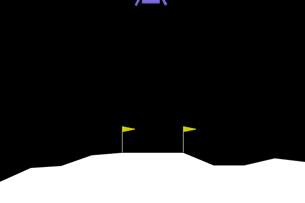
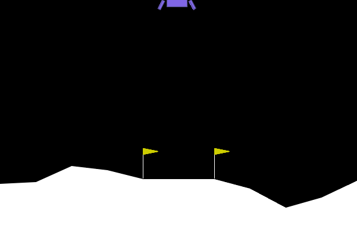

## Exercice 1 — Exploration de Gymnasium

### Visualisation de l’agent aléatoire



---

### Espaces de l’environnement

Espace d’observation (capteurs) :
Box(..., shape=(8,), float32)

L’environnement fournit donc un vecteur de **8 variables continues** :
- position horizontale
- position verticale
- vitesse horizontale
- vitesse verticale
- angle du module
- vitesse angulaire
- contact jambe gauche
- contact jambe droite

Espace d’action (moteurs) :
Discrete(4)

Les actions possibles sont :
- 0 : Ne rien faire
- 1 : Moteur latéral gauche
- 2 : Moteur principal
- 3 : Moteur latéral droit

---

### Rapport de vol

```text
--- RAPPORT DE VOL ---
Issue du vol : CRASH DÉTECTÉ 💥
Récompense totale cumulée : -128.62 points
Allumages moteur principal : 23
Allumages moteurs latéraux : 64
Durée du vol : 116 frames
Vidéo de la télémétrie sauvegardée sous 'random_agent.gif'


## Exercice 2 — Entraînement et évaluation PPO (Stable Baselines3)

### Évolution de `ep_rew_mean` pendant l’entraînement

Pendant l’apprentissage PPO, la métrique `ep_rew_mean` (récompense moyenne par épisode) a nettement augmenté.

- Au début (vers `total_timesteps = 2048`), on observe `ep_rew_mean ≈ -194`.
- À la fin de l’entraînement (vers `total_timesteps ≈ 500000`), `ep_rew_mean` est monté autour de **~100** (ex: `ep_rew_mean ≈ 102`).

Cette hausse indique que l’agent apprend progressivement une stratégie de pilotage plus efficace qu’un agent aléatoire, même si la performance finale n’est pas suffisante pour “résoudre” l’environnement.

---

### Visualisation de l’agent PPO entraîné



---

### Rapport de vol PPO

```text
--- RAPPORT DE VOL PPO ---
Issue du vol : CRASH DÉTECTÉ 💥
Récompense totale cumulée : -11.21 points
Allumages moteur principal : 147
Allumages moteurs latéraux : 138
Durée du vol : 285 frames
Vidéo de la télémétrie sauvegardée sous 'trained_ppo_agent.gif'


## Exercice 3 — Reward Engineering (Wrappers et Hacking)

### 3.a — Wrapper de pénalité carburant

On a créé un wrapper Gymnasium qui intercepte `step(action)` et modifie la récompense si l’agent utilise le moteur principal (action `2`).  
Récompense modifiée :
\[
r'(s,a,s') = r(s,a,s') - 50\cdot\mathbb{1}[a=2]
\]

### 3.b — Exécution, télémétrie et stratégie observée

#### Sortie terminal

```text
python3 reward_hacker.py 
--- ENTRAÎNEMENT DE L'AGENT RADIN ---
Using cpu device
Wrapping the env with a `Monitor` wrapper
Wrapping the env in a DummyVecEnv.
...
Entraînement terminé.

--- ÉVALUATION ET TÉLÉMÉTRIE ---

--- RAPPORT DE VOL PPO HACKED ---
Issue du vol : CRASH DÉTECTÉ 💥
Récompense totale cumulée : -104.40 points
Allumages moteur principal : 0
Allumages moteurs latéraux : 10
Durée du vol : 79 frames
Vidéo du nouvel agent sauvegardée sous 'hacked_agent.gif'


### Interprétation en termes de MDP

En modifiant la récompense via le wrapper, nous avons implicitement modifié la fonction de récompense du MDP sous-jacent.  
L’agent n’interagit plus avec l’environnement original \( (S, A, P, R, \gamma) \), mais avec un nouveau MDP \( (S, A, P, R', \gamma) \).

Le comportement appris est donc parfaitement cohérent avec le nouvel objectif optimisé.  
Le problème ne vient pas de l’algorithme PPO, mais de la mauvaise spécification de la fonction de récompense.

Ce phénomène illustre un principe central en Reinforcement Learning :
"Un agent optimise exactement ce qu’on lui demande, pas ce qu’on voulait dire."

## Exercice 4

python3 ood_agent.py
--- ÉVALUATION OOD : GRAVITÉ FAIBLE ---

--- RAPPORT DE VOL PPO (GRAVITÉ MODIFIÉE) ---
Issue du vol : CRASH DÉTECTÉ 💥
Récompense totale cumulée : -53.58 points
Allumages moteur principal : 25
Allumages moteurs latéraux : 191
Durée du vol : 220 frames
Vidéo de la télémétrie sauvegardée sous 'ood_agent.gif'

### Observation détaillée du GIF

Dans la gravité faible, le vaisseau adopte une trajectoire diagonale vers la droite et finit par atterrir (ou s’écraser) très loin de la zone centrale, du côté droit du terrain.

On observe :

- Une dérive latérale continue vers la droite
- De très nombreuses corrections latérales (191 activations)
- Une stabilisation verticale relativement lente (gravité faible)
- Une absence de recentrage vers la zone d’atterrissage centrale

L’agent ne corrige jamais réellement sa position horizontale vers le centre. Il semble appliquer une stratégie "pré-apprise" qui ne correspond plus à la nouvelle dynamique.

### Pourquoi cette dérive diagonale apparaît-elle ?

À l'entraînement (gravité = -10.0), la chute est rapide.  
L’agent a appris que :

- La gravité corrige naturellement certaines dérives horizontales.
- Les corrections latérales doivent être courtes et précises.
- Le timing des moteurs dépend fortement de la vitesse verticale.

En gravité faible (-2.0), plusieurs effets changent :

1. La chute est beaucoup plus lente → le vaisseau reste longtemps en altitude.
2. Les corrections latérales ont un effet plus durable (moins de "freinage naturel" par la descente rapide).
3. Les petites erreurs horizontales s’accumulent au lieu d’être amorties.

Ainsi, une légère inclinaison initiale produit une accélération horizontale prolongée, ce qui explique la dérive diagonale continue vers la droite.

L’agent applique une politique π(a|s) optimisée pour une dynamique où :
\[
P_{\text{train}}(s_{t+1} \mid s_t, a_t)
\]
était définie avec g = -10.

En test, la transition devient :
\[
P_{\text{test}} \neq P_{\text{train}}
\]

Donc les actions produisent des effets non anticipés par le réseau.  
La politique n’est plus calibrée pour cette physique, ce qui provoque une instabilité et une dérive systématique.

Ce phénomène illustre parfaitement un problème de généralisation Out-of-Distribution :  
le modèle n’a pas appris les lois physiques abstraites du système, mais une stratégie spécifique adaptée à la distribution d’entraînement.

Un simple changement de paramètre physique suffit à révéler la fragilité de la politique apprise.


Exercice 5 — Bilan Ingénieur : Sim-to-Real

5.a — Rendre l’agent robuste sans entraîner un modèle par lune

L’échec en gravité modifiée montre que l’agent a surappris la physique de l’environnement d’entraînement. Pour éviter d’entraîner un modèle spécifique pour chaque lune, on peut mettre en place les stratégies suivantes :

1) Domain Randomization

Au lieu d’entraîner avec une gravité fixe, on entraîne l’agent sur une variété de conditions physiques :

Gravité aléatoire à chaque épisode

Vent et turbulence variables

Éventuellement variations de masse ou de puissance moteur

Ainsi, l’agent apprend une stratégie robuste valable dans plusieurs environnements, et non adaptée à un seul cas précis.

2) Ajouter les paramètres physiques dans l’observation

On peut fournir à l’agent des informations explicites sur la gravité ou le vent dans son vecteur d’état.
Il apprend alors à adapter son comportement en fonction des conditions physiques rencontrées.
Un seul modèle peut ainsi fonctionner sur différentes lunes sans ré-entraînement complet.

Conclusion

Le Sim-to-Real Gap apparaît lorsque la dynamique réelle diffère de celle utilisée en simulation.
En diversifiant les conditions d’entraînement et en rendant les paramètres physiques observables, on améliore la robustesse du modèle sans changer d’algorithme ni multiplier les modèles.